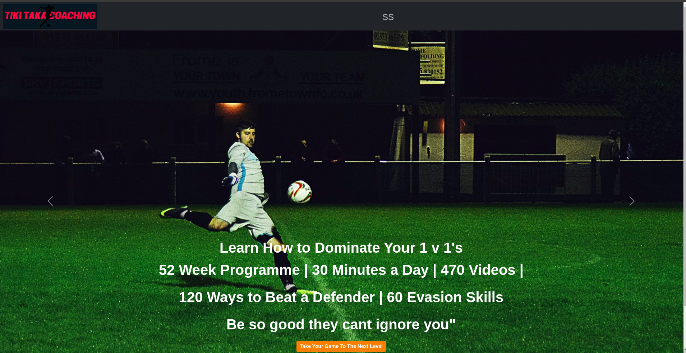
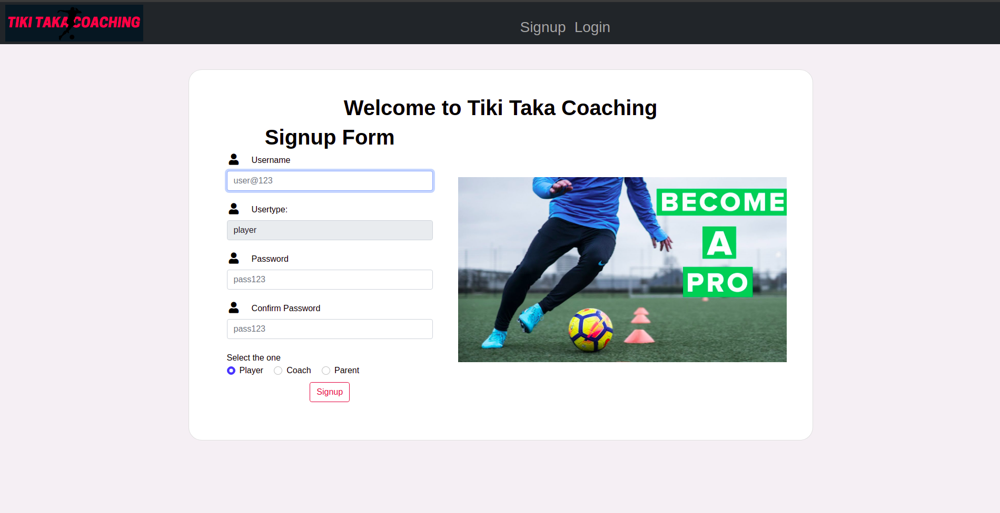
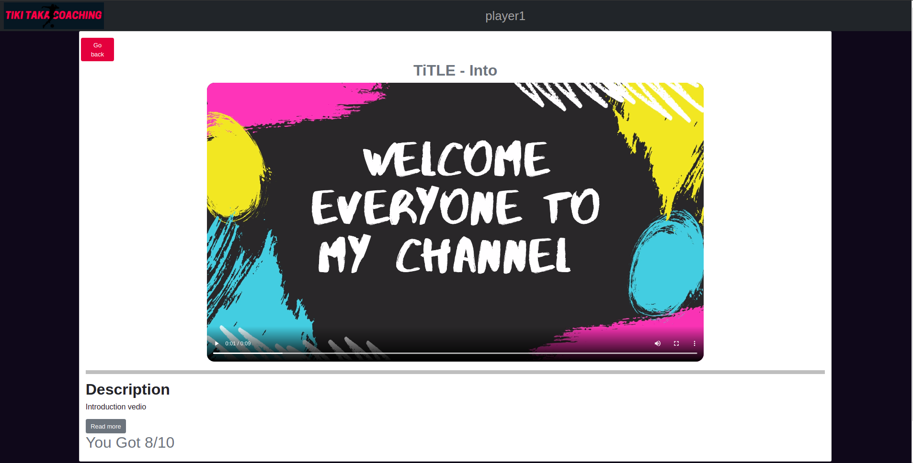
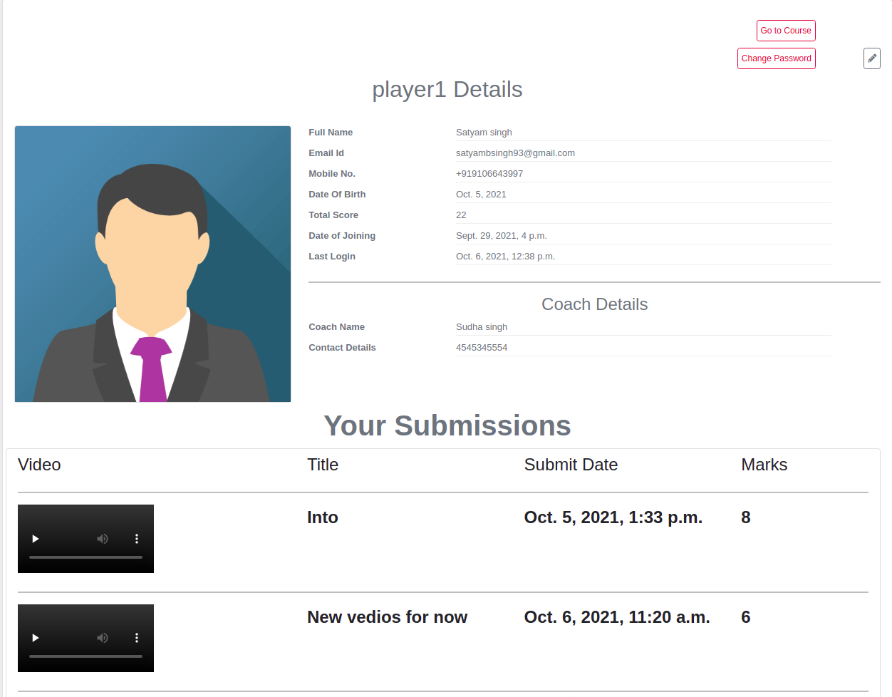
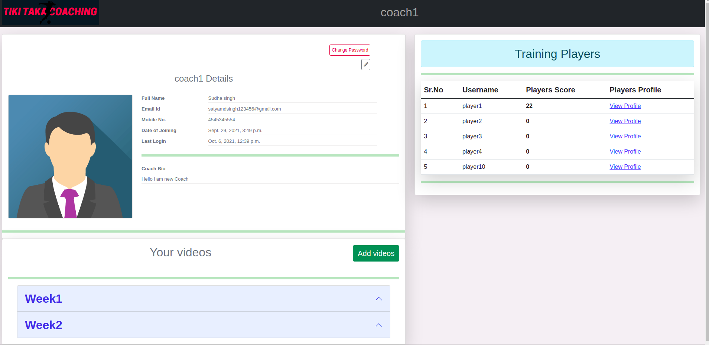

# TIKi - TAKA Coaching
# Installation Setup
  - ### Create a virutal environment for the project and activate it
    -  #### Windows refer this -- > [windows setup](https://www.stanleyulili.com/django/how-to-install-django-on-windows/)
    - #### Ubuntu refer this ----> [ubutnut setup](https://www.javatpoint.com/django-virtual-environment-setup)
    - #### Mac refer this -------> [mac users setup](https://appdividend.com/2018/03/28/how-to-install-django-in-mac/)
  - You can create a folder for the project can direclty the repo using these ` git clone https://github.com/satyam4484/Pinterest---clone.git` .
  - install required dependies for the project using  ` pip install -r requirements.txt`.
  - make you are in the folder where the file python manage.py exists , then run the command `python manage.py runserver ` to start the server , click the link and you will be redirected to webpage of the project .

# Project images 
  - ## Home page 
    - ## These is how the home page looks 
       
    ------
  - ## Login form , Signup form , Password change form
    - ## I have made a common form for all these operations and is linked to single page only
        
    -----
  - ## View Video page for player 
    - ## These when user clicks to particular vedio then he will be redirected here and see and submit his/her vedio  
        
    ----
  - ## Player Profile Where user can see all his submission and edit the details accordingly 
    - ## 

    ----
  - ## Coach Profile where he will see all player requests , add vedios, give player marks and all  
    - ## 

# Contributions
  - Pull requests are welcome. For major changes, please open an issue first to discuss what you would like to change.